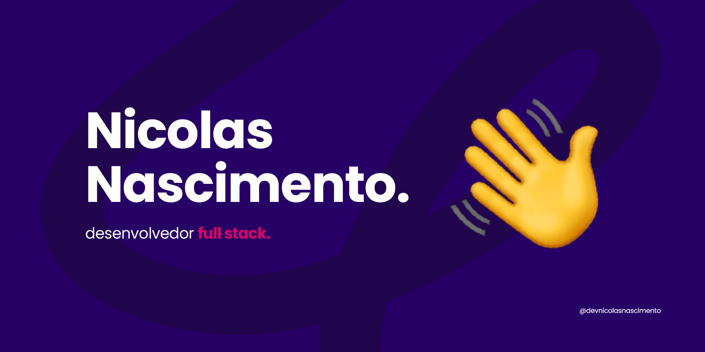

# Olá! seja <em>bem-vindo(a).</em> 💻 

. ݁₊ ⊹ . ݁ ⟡ ݁ . ⊹ ₊ ݁.

 

 

Olá! Eu me chamo Nicolas, estudante de Sistemas e Mídias Digitais na Universidade Federal do Ceará (UFC), com foco em desenvolvimento Full Stack. Estou constantemente aprendendo e aprimorando minhas habilidades em tecnologia e desenvolvimento web.

  

  
  
  
  
  

